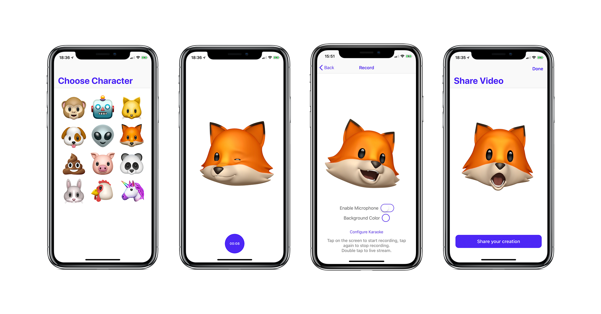

If you're into cute characters, try [ChibiStudio](https://getchibistudio.com) 😉

<h1 style="color:#5501FF">AnimojiStudio</h1>
Record Animoji videos with unlimited duration with this standalone app.

This app uses the private AvatarKit framework, the same one that's used by Apple's iMessage app. It leverages ReplayKit's screen recording capabilities to allow for longer recordings than the standard app.

You can also choose to record with or without audio.

***NOTE: This app uses a private framework, therefore it will not be published on the App Store and can only be installed by compiling and running from Xcode or sideloading the IPA. Please do not file issues about installation problems, that's out of the scope of this project.***

### Top features:
- Record Animoji videos with unlimited duration
- Customize the background color
- Live stream your Animoji to services like Mobcrush and Periscope
- Record Animoji videos without pausing audio playback from other apps (when microphone is disabled)

### Karaoke mode

Lip sync to your favorite songs using Karaoke mode. Tap "Configure Karaoke", search for the song you want and select it.

When you press record, the song will automatically start playing and will be recorded with your Animoji video.

*Karaoke mode requires a premium Spotify subscription and the Spotify app to be installed on your iPhone.* **I don't recommend using AirPods for karaoke mode because it introduces a delay that makes the audio and video get out of sync.**

You can also try to install the app on your iPhone X using Cydia Impactor and the [prebuilt IPA](https://github.com/insidegui/AnimojiStudio/releases/latest).