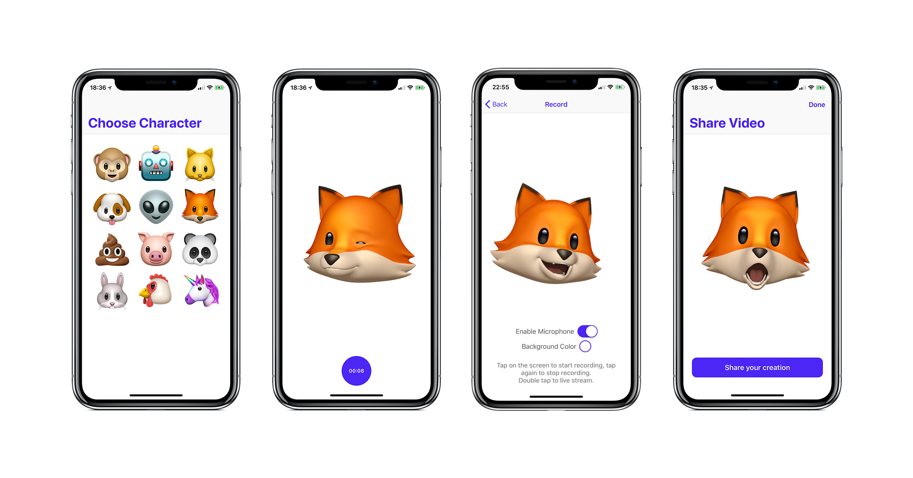

<h1 style="color:#5501FF">AnimojiStudio</h1>
Record Animoji videos with unlimited duration with this standalone app.

This app uses the private AvatarKit framework, the same one that's used by Apple's iMessage app. It leverages ReplayKit's screen recording capabilities to allow for longer recordings than the standard app.

You can also choose to record with or without audio.

***NOTE: This app uses a private framework, therefore it will not be published on the App Store and can only be installed by compiling and running from Xcode or sideloading the IPA. Please do not file issues about installation problems, that's out of the scope of this project.***

You can also try to install the app on your iPhone X using Cydia Impactor and the [prebuilt IPA](https://github.com/insidegui/AnimojiStudio/releases/latest).